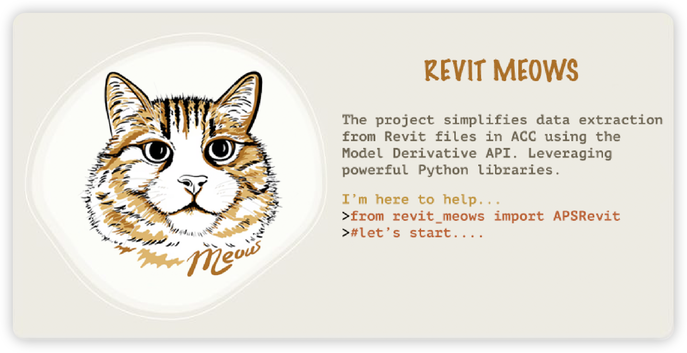

## Description

The project simplifies data extraction from Revit model in [ACC](https://construction.autodesk.com/) using the Model [Derivative API](https://aps.autodesk.com/en/docs/model-derivative/v2). Leveraging powerful [Python](https://www.python.org/) libraries, it enables efficient visualization and analysis of [Revit](https://www.autodesk.com/sg/products/revit/overview) data.

## Installation

```bash
pip install revit_meows
```

## Simple Usage

- Get All Categories

```python
from revit_meows import APSRevit
from aps_toolkit import Auth
token = Auth().auth3leg()
urn = "<urn of item version>"
revit_meows = APSRevit(urn,token)
categories = revit_meows.get_all_categories()
print(categories)
```

- Export All Revit Data To CSV
```python
from revit_meows import APSRevit
from aps_toolkit import Auth
token = Auth().auth3leg()
urn = "<urn of item version>"
revit_meows = APSRevit(urn,token)
df = revit_meows.get_all_data()
df.to_csv("revit_data.csv")
```
Explore more in the [Examples](./docs/example.ipynb).

## Features

- [x] Get All Revit Categories
- [x] Get Revit Data By Categories
- [x] Get All Revit Data From Model In ACC
- [x] Get Bounding Box of Revit Element data

## Development Usage

```
pip install -e .
```

## License

This project is licensed under the Apache License - see the [LICENSE](./License.md) file for details.

## Learning Resources
- [Autodesk Platform Services](https://github.com/autodesk-platform-services)

- [Model Properties API v.s. Model Derivative API](https://aps.autodesk.com/blog/model-properties-api-vs-model-derivative-api)

## Q&A

<details><summary>How can I get URN input?</summary>

1. You can use `aps-toolkit` library to get URN of the item latest version.

```python
from aps_toolkit import *
token  = Auth().auth2leg()
bim360 = BIM360(token)
urn = bim360.get_latest_derivative_urn("<project_id>","<folder_id>")
```

2. You can batch report urn to dataframe from BIM360 class in `aps-toolkit` library.

```python
url = "https://acc.autodesk.com/docs/files/projects/....?version=urn%3Aadsk.wipprod%3Afs.file%3A...."
from aps_toolkit import BIM360
from aps_toolkit import Auth
token  = Auth().auth3leg()
bim360 = BIM360(token)
df = bim360.batch_report_items("<project_id>","<folder_id>",['.rvt'],is_sub_folder=False)
```
</details>
